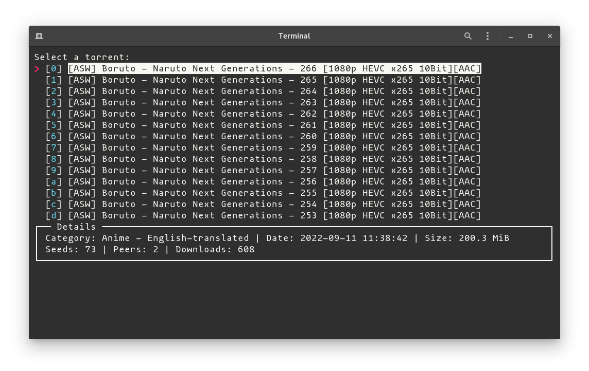

# Nyaa DL
-------
<small><i>A CLI tool to download and run a custom command on Nyaa Torrents
entries easily!</i></small>

## Motivation

My workflow to consume anime is to check my anime list, see what's the next
episode I have to watch, hop on Nyaa Torrents, search for "name of the anime" +
"name of the sub/release team", or "h265", then copy the torrent link, then open
a terminal, then use [webtorrent][webtorrent] to stream the content directly to
my media player, or download it sequentially if I'm on mobile.

This is very tedious, so I wanted to remove a few of these steps.


## Usage

Running

```
nyaadl naruto asw
```



Then selecting an entry will run `webtorrent <URL of the .torrent>` by default.


This behavior can be customized through the command-line, environment variables,
or a config file.

```
nyaadl naruto asw --command "send_to_seedbox.sh {}"
```

```
$ cat ~/.config/nyaadl.yml

command: webtorrent {}
```


You can also pass `-s` to use Sukebei instead of the default Nyaa site.


## Installing

```
pip install nyaadl
```

[webtorrent]: https://github.com/webtorrent/webtorrent-cli
